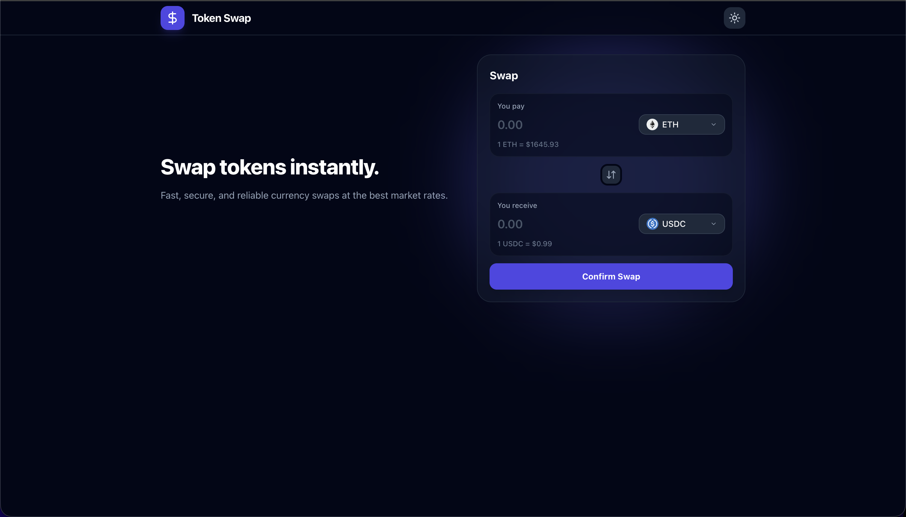

# Fancy Currency Swap Form

A highly optimized, accessible, and responsive Currency Swap UI built with React, TypeScript, and Tailwind CSS.



## Features

- **Modern UI/UX**: Sleek, fully responsive design with Light/Dark mode support seamlessly adapting to system preferences.
- **Glassmorphism Design**: Uses backdrop filters and transparent surfaces for a modern, premium aesthetic.
- **Custom Accessible Dropdown**:
  - Implements a custom `<CurrencySelect />` component that acts like a native `<select>`.
  - Supports full keyboard navigation: `ArrowUp`, `ArrowDown`, `Enter` to select, and `Escape` to close.
  - Automatically scrolls the dropdown list to ensure the focused token is always visible.
- **Robust Error Handling & Fallbacks**:
  - Live data fetching with error boundaries.
  - Token icons gracefully fall back to a generic default avatar if a token icon is missing from the API.
- **Extreme Performance Optimizations**:
  - `React.memo` and `useCallback` prevent unnecessary re-renders of the form inputs on every keystroke.
  - Token icons are `loading="lazy"`, preventing the browser from instantly attempting to download 100+ SVGs when opening the dropdown.
  - Click-outside detection uses native React `onBlur` events, completely eliminating the need for expensive global `document` event listeners!

## Architecture Highlights

1. **Modular Components**: The monolithic form was broken down into `CurrencyInput.tsx` and `CurrencySelect.tsx`, maximizing reusability.
2. **Business Logic Extraction**: Pure math and format conversions are isolated in `utils/swap.ts`.
3. **Custom Hooks**: API fetching and data caching are handled exclusively in `useTokenPrices.ts`.
4. **Strict TypeScript**: Ensures absolute type safety across the entire application, utilizing `verbatimModuleSyntax` for proper type imports.

## Running Locally

1. Install dependencies:
   ```bash
   npm install
   ```
2. Start the Vite development server:
   ```bash
   npm run dev
   ```
3. Open `http://localhost:5173/` in your browser.
